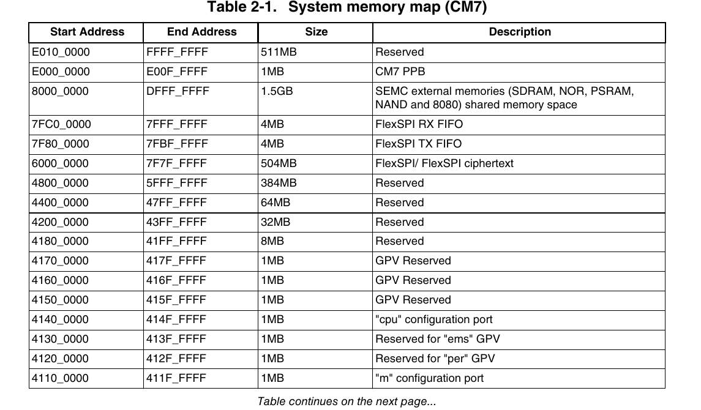
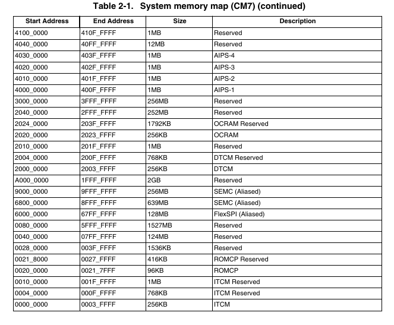

# I.MXRT 1020 Information

## Memory Map

The memory map file of i.mxrt 1020 is following

In MIMXRT1020-EVK, there are one 8MB flash connected to FlexSPI and another 30 MB RAM to external memory interface.

## Boot

EVK could be chosen as internal boot or serial boot. The default is internal boot. 
